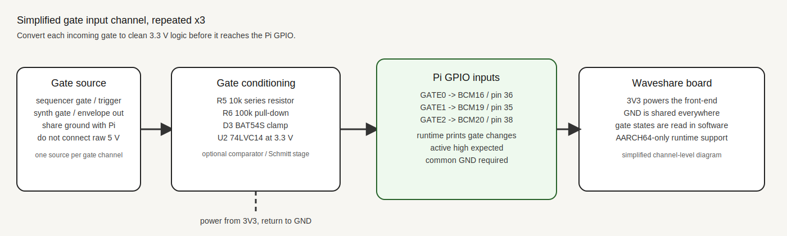

# Analog Front End

This document covers the Pi-only analog front end used on the AARCH64 build.

## Overview

The analog path is split into two parts:

- A 16-channel CV bank on the Waveshare board ADC input `AD0` using a `CD74HC4067`.
- Three separate gate inputs on free Pi GPIO pins for note/gate/trigger events.

The runtime support is AARCH64-only and prints sampled CV values and gate states to the console.

## CV Bank On `AD0`

The mux common pin goes to `AD0`. The Pi drives the mux select lines and the ADC samples whichever channel is selected.

### Pin Map

| Function | Pi BCM | Physical pin |
|---|---|---|
| `S0` | 5 | 29 |
| `S1` | 6 | 31 |
| `S2` | 13 | 33 |
| `S3` | 26 | 37 |

### Power And Wiring

| Mux pin | Connect to |
|---|---|
| `VCC` | Waveshare board `3V3` |
| `GND` | Waveshare board `GND` |
| `COM` / `SIG` | `AD0` |
| `S0` | Pi `GPIO5` |
| `S1` | Pi `GPIO6` |
| `S2` | Pi `GPIO13` |
| `S3` | Pi `GPIO26` |
| `EN` | `GND` |
| `VEE` | `GND` if exposed |

### CV Input Rules

- Keep all CV sources referenced to the same ground as the Waveshare board.
- Do not feed negative voltage into the ADC input path.
- Do not exceed the ADC input range. If a source is above 5 V, attenuate it first.
- For bipolar CV, shift it into the 0 V to 5 V range before `AD0`.

Suggested front-end conditioning:

| Source type | Simplest conditioning |
|---|---|
| `0-5 V` unipolar CV | Optional 1 k series resistor, then straight into the mux channel |
| `0-10 V` unipolar CV | 2:1 divider, then a 1 k series resistor |
| `-5 V to +5 V` bipolar CV | Op-amp level shifter to mid-rail, then clamp to 0 V to 5 V |

### CV Schematic

## Gate Inputs

Three gate inputs are read as digital GPIO states. These are intended for on/off modulation sources such as synth gates, sequencer gates, envelopes, and triggers.

### Pin Map

| Gate | Pi BCM | Physical pin |
|---|---|---|
| `GATE0` | 16 | 36 |
| `GATE1` | 19 | 35 |
| `GATE2` | 20 | 38 |

### Power And Wiring

| Gate front-end pin | Connect to |
|---|---|
| `OUT0` | Pi `GPIO16` |
| `OUT1` | Pi `GPIO19` |
| `OUT2` | Pi `GPIO20` |
| `VCC` | Waveshare board `3V3` or another regulated `3.3 V` rail |
| `GND` | Waveshare board `GND` |

### Gate Input Rules

- Convert each incoming gate to clean 3.3 V logic before it reaches the Pi GPIO.
- Keep a common ground between the front-end board, the Pi, and any external synth or sequencer.
- Do not connect 5 V gate signals directly to the GPIO pins.
- If the source can swing negative or exceed 3.3 V, use a resistor, clamp, comparator, or Schmitt trigger stage.

Suggested front-end channel:

- Input resistor: 10 k to 100 k
- Clamp: to 0 V and 3.3 V
- Optional pull-down: 100 k to GND
- Optional Schmitt stage for cleaner edges

### Gate Schematic

## Runtime Output

The monitor prints the analog and gate state to the console.

- CV mux channels appear as `[ads1256] mux AD7 = ...`
- Gate states appear as `[ads1256] gates G0=HIGH G1=LOW G2=HIGH`

The gate polling interval can be adjusted with `COCKSCREEN_ADS1256_GATE_POLL_MS`. The mux scan count can be forced back to a single direct ADC read with `COCKSCREEN_ADS1256_MUX_CHANNELS=1`.
