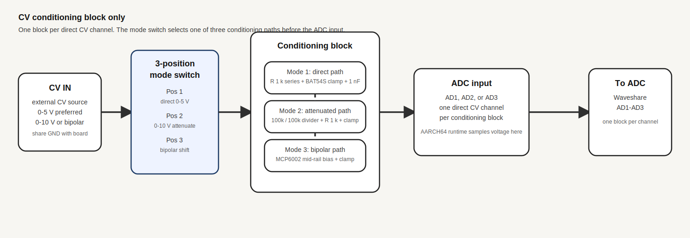
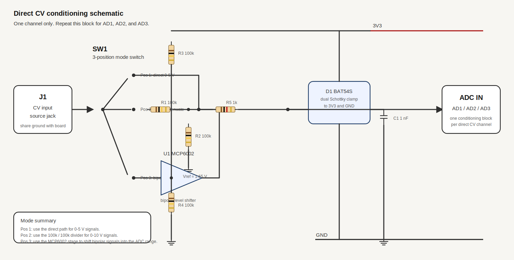
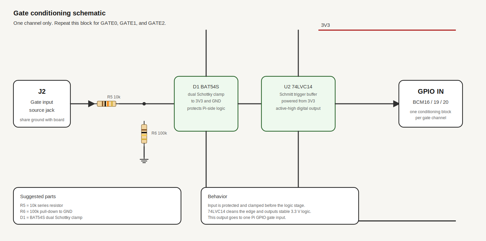

# Analog Front End

This document covers the Pi-only analog front end used on the AARCH64 build.

## Overview

The analog path is split into three parts:

- Three direct CV inputs on the Waveshare board ADC channels `AD1`, `AD2`, and `AD3`.
- A control surface built from eight user-supplied manual pots on the Waveshare board ADC input `AD0` using a `CD74HC4067`, one I2C NeoSlider module, one `MCP23017` I2C GPIO expander with eight buttons, and two motorized faders.
- Three separate gate inputs on free Pi GPIO pins for note/gate/trigger events.

The runtime support is AARCH64-only and prints sampled CV values and gate states to the console.

### Desktop Enclosure

A good orderable desktop enclosure for this layout is the Hammond 1456WL3BKBK sloped metal console.

- 15 degree sloped top for comfortable knob and fader access
- 20.26 x 11.61 x 3.21 in overall size
- wide enough for eight manual pots, eight buttons, one NeoSlider, and two motorized faders without going to a rack chassis
- if you want a steeper layout, the Hammond 1456WK4BKBK is the 30 degree alternate
- if you want a DIY build, see [diy-enclosure-option-2.md](diy-enclosure-option-2.md) for a plywood-shell and aluminum-top-panel rough cut/layout

## Detailed Proposed Schematic

The preferred front-end is drawn in [analog-front-end-detailed.svg](analog-front-end-detailed.svg). It shows the direct CV blocks, the control-surface layout, the NeoSlider module, the `MCP23017` button expander, the motorized faders, and the gate inputs in one board-level diagram.

The short version is:

- Direct CV attenuation for 0-10 V sources: `100k` / `100k` divider.
- Direct CV series protection: `1k`.
- Direct CV clamp: two `1N4148` diodes to `0 V` and `3V3`.
- Direct CV low-pass filter: `1 nF` to ground.
- Optional bipolar CV stage: `MCP6002-I/P` dual rail-to-rail op-amp in DIP-8 with `100k` / `100k` mid-rail bias.
- Pot mux series protection: `1k`.
- Pot mux clamp: two `1N4148` diodes to `0 V` and `3V3`.
- Control surface: eight user-supplied manual pots, eight momentary buttons on one `MCP23017` I2C expander, one NeoSlider I2C slider module, and two motorized faders.
- Button bank: one `MCP23017-E/SP` with eight normally-open buttons on `GPA0` through `GPA7`.
- Motorized fader drive: one `L9110` two-channel motor-driver module, one channel per fader.
- Gate series resistor: `10k`.
- Gate pull-down: `100k`.
- Gate clamp: two `1N4148` diodes to `0 V` and `3V3`.
- Gate buffer: `SN74LVC14AN` Schmitt trigger at `3.3 V`.

## Direct CV Inputs On `AD1`-`AD3`

The three direct CV inputs are wired to the ADC channels `AD1`, `AD2`, and `AD3`. They do not go through the `CD74HC4067`; only the pot bank uses `AD0`.

Each CV channel assumes a 3-position mode switch in front of the conditioning block:

- Position 1: direct `0-5 V` input
- Position 2: `0-10 V` attenuated input
- Position 3: bipolar input shifted into the `0 V` to `5 V` range

### Pin Map

| CV channel | ADC input | Notes |
|---|---|---|
| `CV0` | `AD1` | direct analog input |
| `CV1` | `AD2` | direct analog input |
| `CV2` | `AD3` | direct analog input |

### Power And Wiring

| CV pin | Connect to |
|---|---|
| `CV0` / `AD1` | direct conditioned CV source |
| `CV1` / `AD2` | direct conditioned CV source |
| `CV2` / `AD3` | direct conditioned CV source |

### Direct CV Circuit

Each direct CV input uses the same element set:

- `Jx` input jack
- `R1` `100k` / `100k` attenuator for `0-10 V` sources
- `R2` `1k` series protection resistor
- `D1` two `1N4148` clamp diodes to `0 V` and `3V3`
- `C1` `1 nF` to ground
- optional `U1` `MCP6002-I/P` if bipolar CV needs mid-rail shifting

### CV Input Rules

- Keep all CV sources referenced to the same ground as the Waveshare board.
- Do not feed negative voltage into the ADC input path.
- Do not exceed the ADC input range. If a source is above 5 V, attenuate it first.
- For bipolar CV, shift it into the 0 V to 5 V range before `AD1`-`AD3`.

### Direct CV Conditioning Block Diagram

### Direct CV Conditioning Schematic

### Direct CV Rough Board Placement

If you want a through-hole prototyping layout for one direct CV conditioning channel, see [analog-cv-conditioning-board-layout.svg](analog-cv-conditioning-board-layout.svg).

## Pot Mux On `AD0`

The mux common pin goes to `AD0`. The Pi drives the mux select lines and the ADC samples whichever manual pot or motorized-fader feedback channel is selected. The mux is used for the control-surface pots and fader feedback, not for the direct CV inputs, the button bank, or the NeoSlider module.

### Pin Map

| Function | Pi BCM | Physical pin |
|---|---|---|
| `S0` | 5 | 29 |
| `S1` | 6 | 31 |
| `S2` | 13 | 33 |
| `S3` | 26 | 37 |

### Power And Wiring

| Mux pin | Connect to |
|---|---|
| `VCC` | Waveshare board `3V3` |
| `GND` | Waveshare board `GND` |
| `COM` / `SIG` | `AD0` |
| `S0` | Pi `GPIO5` |
| `S1` | Pi `GPIO6` |
| `S2` | Pi `GPIO13` |
| `S3` | Pi `GPIO26` |
| `EN` | `GND` |
| `VEE` | `GND` if exposed |

Wire each manual potentiometer or motorized-fader feedback track with one outer leg to `3V3`, the other outer leg to `GND`, and the wiper to one of the mux channels `C0` through `C15`.

### Pot Mux Rules

- Use only manual potentiometers or motorized-fader feedback tracks on the mux channels.
- Keep the pot grounds common with the Waveshare board.
- Each mux channel should stay inside the ADC range after the pot wiring and any local series protection.

### Pot Mux Schematic

The pot mux is shown in the board-level schematic above. It is the `AD0` section of [analog-front-end-detailed.svg](analog-front-end-detailed.svg).

## Button Bank On I2C

The eight control buttons sit on one `MCP23017` I2C GPIO expander. This keeps the button bank off the analog mux and avoids consuming eight separate Pi GPIO pins.

For the first-pass wiring, keep the expander at the default I2C address `0x20` by tying `A0`, `A1`, and `A2` to `GND`.

### Pin Map

| Function | MCP23017 pin group | Connect to |
|---|---|---|
| `SDA` | `SDA` | Pi `BCM2` / physical pin `3` |
| `SCL` | `SCL` | Pi `BCM3` / physical pin `5` |
| `BTN0`-`BTN7` | `GPA0`-`GPA7` | one button per pin |
| address select | `A0`, `A1`, `A2` | `GND` for address `0x20` |
| reset | `RESET` | `3V3` |
| spare bank | `GPB0`-`GPB7` | leave unused for now |
| interrupts | `INTA`, `INTB` | optional spare Pi GPIO later |

### Power And Wiring

| MCP23017 pin | Connect to |
|---|---|
| `VDD` | Waveshare board `3V3` |
| `VSS` | Waveshare board `GND` |
| `SDA` | Pi `GPIO2` |
| `SCL` | Pi `GPIO3` |
| `A0`, `A1`, `A2` | `GND` |
| `RESET` | `3V3` |
| `GPA0`-`GPA7` | one side of buttons `B1`-`B8` |

Wire the other side of each button to the shared ground rail. In the first-pass firmware, enable the `MCP23017` internal pull-ups so each button reads active-low without extra resistors.

### Button Rules

- Keep the button bank on the shared I2C bus with the NeoSlider.
- Use normally-open momentary buttons from `GPA0`-`GPA7` to `GND`.
- Enable internal pull-ups in the expander instead of adding eight external pull-up resistors.
- The first-pass design can poll button state over I2C, so no dedicated Pi interrupt pin is required.
- `GPB0`-`GPB7` stay available for later LEDs, transport buttons, or interrupt-driven expansion.

## Motorized Faders

The two COM-10976 motorized faders are panel controls with a 10k linear position pot and a small motor. Treat each one as two subsystems:

- a position wiper sampled on `AD0` through a spare mux channel
- a motor driven by one channel of an `L9110` two-channel driver module

### Power And Wiring

| Fader pin | Connect to |
|---|---|
| `WIPER` | One of the spare mux channels |
| `MOTOR+` / `MOTOR-` | `L9110` channel output pair |
| `VCC` / motor rail | `5 V_DIG` or a separate motor rail sized to the fader datasheet |
| `GND` | Shared ground |
| `TOUCH` if exposed | Optional spare Pi GPIO |

### Driver Rules

- One two-channel `L9110` module can drive both motorized faders.
- Keep the driver and motor-supply decoupling close to the panel harness.
- The firmware needs to compare the sampled fader position against the target position before moving the motor.
- The Adafruit NeoSlider module and the `MCP23017` button expander are separate on I2C and do not use the mux.

### Proposed Motor Logic Pins

For a first-pass wiring that does not collide with the current ADS1256, mux, gate, or I2C assignments, use four dedicated Pi outputs for the `L9110` input pins, two per fader motor channel.

| Driver signal | `L9110` input | Pi BCM | Physical pin | Purpose |
|---|---|---|---|---|
| `F1_IA` | channel A `IA` | `23` | `16` | motorized fader 1 control input A |
| `F1_IB` | channel A `IB` | `24` | `18` | motorized fader 1 control input B |
| `F2_IA` | channel B `IA` | `25` | `22` | motorized fader 2 control input A |
| `F2_IB` | channel B `IB` | `21` | `40` | motorized fader 2 control input B |

### Motor Logic Truth Table

For each L9110 motor channel:

| `IA` | `IB` | Result |
|---|---|---|
| `0` | `0` | coast |
| `1` | `0` | drive one direction |
| `0` | `1` | drive opposite direction |
| `1` | `1` | brake |

### PWM Upgrade Plan

The L9110 module does not expose separate enable pins. If variable speed is needed later, PWM must be applied on the active `IA` or `IB` line for that motor channel.

That leaves three realistic options on the current header plan:

| Option | Wiring | Tradeoff |
|---|---|---|
| Keep full-speed drive | use plain digital `IA` / `IB` switching only | simplest and already matches the first-pass plan |
| Software PWM on the active input | apply PWM to whichever `IA` or `IB` line is asserting the active direction | possible, but Linux timing jitter makes it less clean than hardware PWM |
| Later pin-budget redesign | reassign one or more motor control lines to hardware-PWM-capable GPIOs | cleaner speed control, but requires a deliberate GPIO remap later |

The practical no-implementation-change recommendation is to keep the initial full-speed design for now. If variable speed is required later, use PWM on the active `IA` / `IB` line for one motor at a time or revisit the GPIO budget before implementation.

### Control-Surface Wiring Map

For a header-and-power wiring view that shows the pot mux, the shared I2C pins for the NeoSlider and `MCP23017`, and the current state of the motor-driver wiring, see [control-surface-header-wiring.svg](control-surface-header-wiring.svg).

## Gate Inputs

Three gate inputs are read as digital GPIO states. These are intended for on/off modulation sources such as synth gates, sequencer gates, envelopes, and triggers.

### Pin Map

| Gate | Pi BCM | Physical pin |
|---|---|---|
| `GATE0` | 16 | 36 |
| `GATE1` | 19 | 35 |
| `GATE2` | 20 | 38 |

### Power And Wiring

| Gate front-end pin | Connect to |
|---|---|---|
| `OUT0` | Pi `GPIO16` |
| `OUT1` | Pi `GPIO19` |
| `OUT2` | Pi `GPIO20` |
| `VCC` | Waveshare board `3V3` or another regulated `3.3 V` rail |
| `GND` | Waveshare board `GND` |

### Gate Input Rules

- Convert each incoming gate to clean 3.3 V logic before it reaches the Pi GPIO.
- Keep a common ground between the front-end board, the Pi, and any external synth or sequencer.
- Do not connect 5 V gate signals directly to the GPIO pins.
- If the source can swing negative or exceed 3.3 V, use a resistor, clamp, comparator, or Schmitt trigger stage.

Suggested front-end channel:

- Input resistor: 10 k to 100 k
- Clamp: to 0 V and 3.3 V
- Optional pull-down: 100 k to GND
- Optional Schmitt stage for cleaner edges

### Gate Conditioning Schematic

### Gate Rough Board Placement

If you want a through-hole prototyping layout for the full three-channel gate board, see [analog-gate-conditioning-board-layout.svg](analog-gate-conditioning-board-layout.svg).

## Power And CV Outputs

All project power comes from a 12 V wall PSU. The input is protected, converted to 5 V_DIG for the Raspberry Pi and digital logic, and then filtered again into 5 V_A for the precision output/reference stage.

The CV output path is designed for microtuning stability. The board exposes four DAC channels (DAC0-DAC3), and each source around 0-2.5 V is filtered and amplified to a calibrated 0-5 V output.

### Power Input And Distribution

For the through-hole prototyping layout of the power-entry, buck, and analog 5 V branch, see [cv-power-input-board-layout.svg](cv-power-input-board-layout.svg).

| Stage | Parts |
|---|---|
| 12 V input | barrel jack, polyfuse, 1N5819 reverse-polarity diode, 1.5KE15A TVS, bulk capacitors |
| 5 V_DIG regulator | LM2596T-5.0, 33 uH inductor, 1N5822 catch diode, output bulk capacitor |
| 5 V_A analog branch | 10 ohm isolation resistor, 470 uF reservoir capacitor, 100 nF C0G decoupling |

### Precision CV Output Channel

Each output channel uses the same element set:

- `Jx` CV output jack
- `R1` `1k` series resistor from the DAC node
- `C1` `10 nF` C0G reconstruction capacitor to ground
- `U1A` `OPA277PA` precision low-noise op-amp in a gain-of-2 stage
- `R2` `10k` 0.1% metal film resistor to ground
- `R3` `9.76k` 0.1% metal film resistor in the feedback network
- `TRIM1` `3296W-1-501` multiturn trimmer for fine gain trim
- `D1` two `1N4148` diodes as output clamps to `0 V` and `5 V_A`
- `C2` `100 nF` decoupling capacitor at the op-amp supply pins

### Reference Rail

- `U2` `AD780AN` precision 2.5 V reference in DIP-8
- `RREF` `10k` 0.1% metal film load resistor
- `CREF1` `100 nF` decoupling capacitor
- `CREF2` `10 uF` reservoir capacitor

### Output Rules

- Keep the DAC and op-amp grounds in a star layout with the power entry point.
- Use 0.1% metal film resistors in the gain network.
- Use C0G/NP0 or film capacitors for the reconstruction and reference decoupling path.
- Calibrate each channel against a known reference before using it for microtuning.

### Output Schematic

The detailed drawing is in [cv-output-stage.svg](cv-output-stage.svg).

### Rough Board Placement

If you want to build one channel by hand on through-hole prototyping material, see [cv-output-stage-board-layout.svg](cv-output-stage-board-layout.svg) for the square-pitch universal perfboard placement map.

## Runtime Output

The monitor prints the analog and gate state to the console.

- CV mux channels appear as `[ads1256] mux AD7 = ...`
- Gate states appear as `[ads1256] gates G0=HIGH G1=LOW G2=HIGH`

The gate polling interval can be adjusted with `COCKSCREEN_ADS1256_GATE_POLL_MS`. The mux scan count can be forced back to a single direct ADC read with `COCKSCREEN_ADS1256_MUX_CHANNELS=1`.
